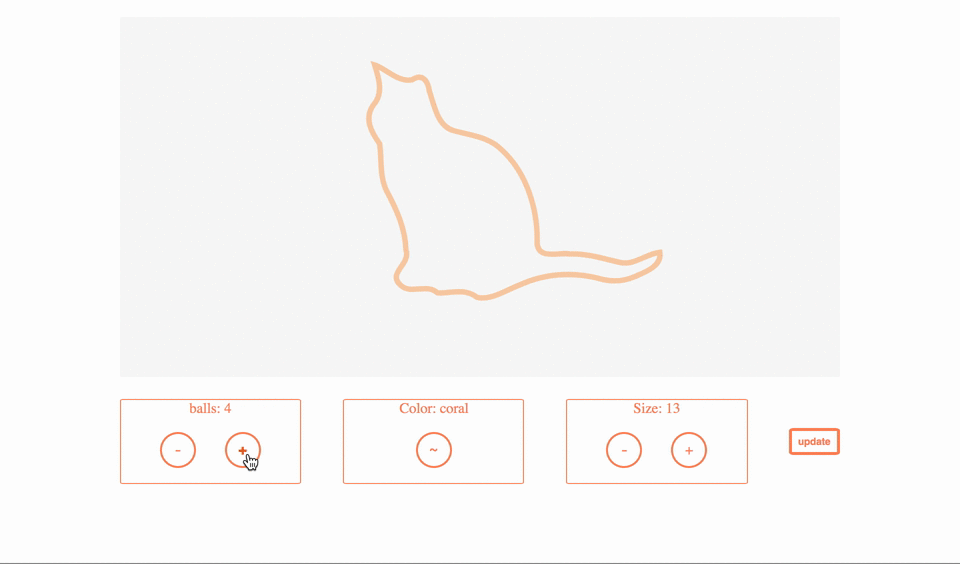

# Enter and Exit WS



### the challenge

all your code will be in App.js. The buttons already update the relevant information in the state, your job is to write the d3 that responds to the information in state.

There are three button panels. One for amount of balls, one for color, one for size. Each one has a 'screen' that says how the balls of wool on the page should look.

### Steps

1. draw the cat. You will need to use a path element, and set the d attribute equal to the catPath value in state. it should have an orange ('#f9c89') outline of 6px.
2. make the update button enter new balls of wool when the number in the amount screen is larger than the amount of balls on the page.
3. make the update button exit balls of wool when the number in the amount screen is smaller than the amount of balls on the page.
4. make the color and size of balls entering reflect the values in the respective screens
5. make the information in the three screens update the entering balls AND the existing balls on the page.

#### Stretch goals

6. make the balls fall in from above (and make them bounce!)
7. make the balls that are exiting the page slide off to the side
8. make updates to colour and size happen gradually

### to run the app for development

in root

```
npm run dev-server
```
